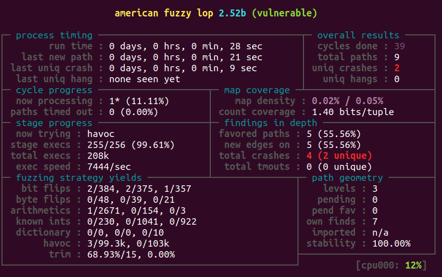

These instructions lead you through setup and fuzzing of a sample program.

Setup
========

Jump to the appropriate part of this Setup section based on what you're
configuring, then go to the next section (Building AFL).

Logging in to the provided instance
-------------------------------------

If you're reading these instructions then you've probably already made it! Skip to the vulnerable program section.

Running the docker image locally
-----------------------------------

See the "Running locally" section of docker/README.md, then skip to the vulnerable program section.

Setting up your own machine manually
---------------------------------------

Install dependencies:

    $ sudo apt-get install clang-6.0 build-essential llvm-6.0-dev gnuplot-nox

Work around some Ubuntu annoyances

    $ sudo update-alternatives --install /usr/bin/clang clang `which clang-6.0` 1
    $ sudo update-alternatives --install /usr/bin/clang++ clang++ `which clang++-6.0` 1
    $ sudo update-alternatives --install /usr/bin/llvm-config llvm-config `which llvm-config-6.0` 1
    $ sudo update-alternatives --install /usr/bin/llvm-symbolizer llvm-symbolizer `which llvm-symbolizer-6.0` 1

Make system not interfere with crash detection:

    $ echo core | sudo tee /proc/sys/kernel/core_pattern

Get, build, and install afl:

    $ wget http://lcamtuf.coredump.cx/afl/releases/afl-latest.tgz
    $ tar xvf afl-latest.tgz
    $ cd afl-2.52b   # replace with whatever the current version is
    $ make && make -C llvm_mode CXX=g++
    $ make install

The `vulnerable` program
========================

Build our quickstart program using the instrumented compiler:

    $ cd quickstart
    $ CC=afl-clang-fast AFL_HARDEN=1 make

Test it:

    $ ./vulnerable
    # Press enter to get usage instructions.
    # Test it on one of the provided inputs:
    $ ./vulnerable < inputs/u

Fuzzing
=======

Fuzz it:

    $ afl-fuzz -i inputs -o out ./vulnerable

Your session should soon resemble this:

For comparison you could also test without the provided example inputs, e.g.:

    $ mkdir in
    $ echo "my seed" > in/a
    $ afl-fuzz -i in -o out ./vulnerable
